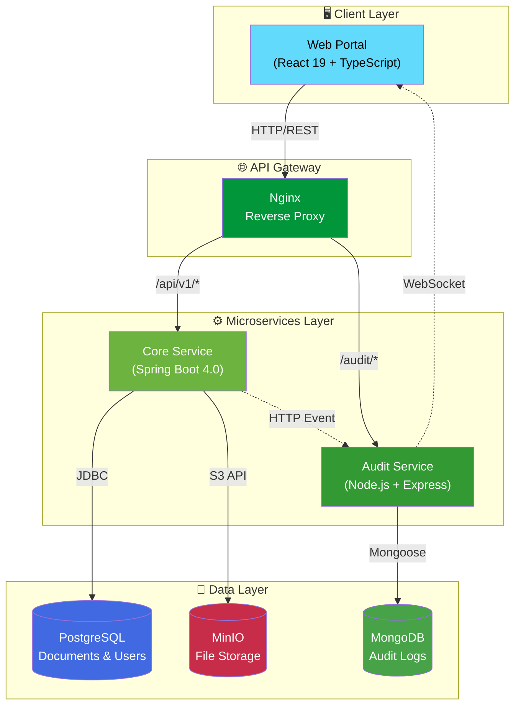
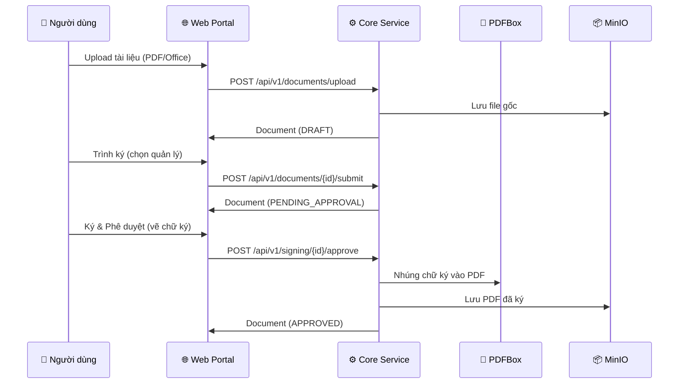
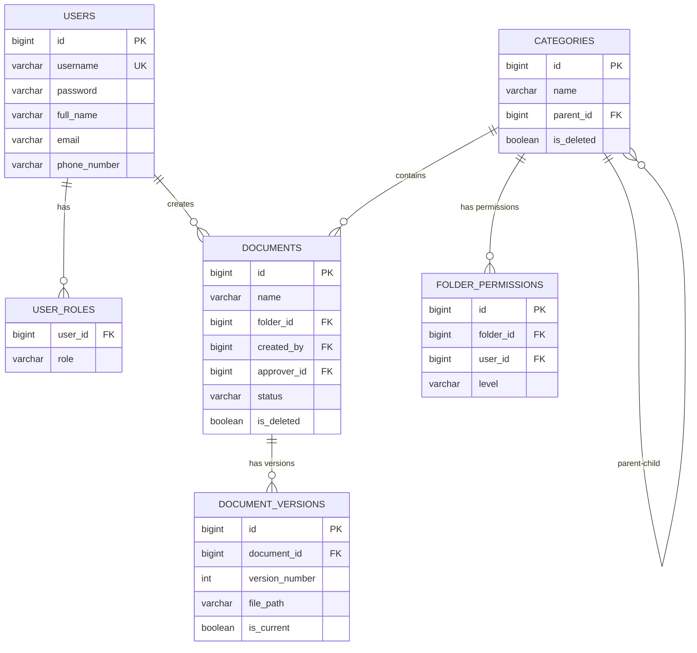

# 📁 SMART-EDMS System

<div align="center">


**Hệ thống Quản lý Tài liệu Điện tử Thông minh** – Giải pháp lưu trữ, quản lý và truy xuất tài liệu doanh nghiệp dựa trên kiến trúc Microservices hiện đại.

[Tính năng](#-tính-năng-chính) • [Kiến trúc](#-kiến-trúc-hệ-thống) • [Công nghệ](#-tech-stack) • [Cài đặt](#-hướng-dẫn-cài-đặt) • [API](#-api-documentation)

</div>

---

## 📋 Giới thiệu

**SMART-EDMS** (Smart Electronic Document Management System) là hệ thống quản lý tài liệu điện tử toàn diện được thiết kế để giúp doanh nghiệp:

- 📂 **Tổ chức tài liệu** theo cấu trúc phân cấp (thư mục, danh mục) một cách khoa học
- 🔍 **Tìm kiếm nhanh chóng** với bộ lọc thông minh và full-text search
- 🔐 **Bảo mật chặt chẽ** với hệ thống phân quyền RBAC (Role-Based Access Control)
- 📊 **Theo dõi hoạt động** với audit log và thông báo real-time
- ☁️ **Lưu trữ đám mây** với MinIO (S3-Compatible Object Storage)
- ✍️ **Ký tài liệu số** với quy trình phê duyệt trực tuyến và chữ ký tay số hóa

---

## ✨ Tính năng chính

| Tính năng                         | Mô tả                                                          | Trạng thái         |
| --------------------------------- | -------------------------------------------------------------- | ------------------ |
| 🔐 **Xác thực & Phân quyền**     | JWT Authentication, Role-based Access Control (Admin/User)     | ✅ Hoàn thành      |
| 📁 **Quản lý Danh mục/Thư mục**  | CRUD danh mục với cấu trúc cây phân cấp (Tree Structure)       | ✅ Hoàn thành      |
| 📄 **Quản lý Tài liệu**          | Upload PDF/Office, xem trước, soft delete, phục hồi, lịch sử  | ✅ Hoàn thành      |
| 🔍 **Tìm kiếm & Lọc**            | Full-text search, lọc theo danh mục, trạng thái, từ khóa       | ✅ Hoàn thành      |
| ✍️ **Quy trình Ký duyệt**        | Trình ký → Phê duyệt/Từ chối → Ký số với chữ ký tay nhúng PDF | ✅ Hoàn thành      |
| 🗑️ **Thùng rác & Khôi phục**    | Soft delete, restore, xóa hẳn, làm trống thùng rác            | ✅ Hoàn thành      |
| 🔔 **Thông báo Real-time**        | WebSocket notifications khi có thay đổi trạng thái tài liệu   | ✅ Hoàn thành      |
| 📊 **Audit Logging**              | Ghi lại mọi thao tác của người dùng với timestamp              | ✅ Hoàn thành      |
| 📈 **Dashboard & Thống kê**       | Thống kê dung lượng lưu trữ, hoạt động theo thời gian         | 🔄 Đang phát triển |
| 👥 **Phân quyền thư mục**        | Gán quyền VIEWER/EDITOR/OWNER/ADMIN theo từng thư mục          | ✅ Hoàn thành      |

---

## 🏛 Kiến trúc hệ thống

### High-Level Architecture



### Quy trình Ký duyệt Tài liệu



### Database Schema (Core Service)



---

## 🛠 Tech Stack

### Frontend

| Technology   | Version | Purpose                   |
| ------------ | ------- | ------------------------- |
| React        | 19.x    | UI Framework              |
| TypeScript   | 5.6     | Type Safety               |
| Vite         | 6.0     | Build Tool & Dev Server   |
| TailwindCSS  | 4.0     | Utility-first CSS         |
| React Router | 7.x     | Client-side Routing       |
| react-pdf    | -       | Xem trước tài liệu PDF    |
| Lucide React | -       | Icon Library              |
| Motion       | 12.x    | Animation Library         |
| Socket.io    | -       | Real-time Notifications   |

### Backend – Core Service

| Technology        | Version  | Purpose                        |
| ----------------- | -------- | ------------------------------ |
| Java              | 21 (LTS) | Programming Language           |
| Spring Boot       | 4.0.2    | Application Framework          |
| Spring Security   | -        | Authentication & Authorization |
| Spring Data JPA   | -        | ORM & Data Access              |
| JWT (jjwt)        | 0.12.3   | Token-based Auth               |
| Apache PDFBox     | 3.x      | PDF manipulation & Signing     |
| Lombok            | -        | Boilerplate Reduction          |
| Springdoc OpenAPI | 2.8.5    | API Documentation (Swagger)    |

### Backend – Audit Service

| Technology | Version | Purpose                 |
| ---------- | ------- | ----------------------- |
| Node.js    | 20.x    | Runtime Environment     |
| Express    | -       | Web Framework           |
| Socket.io  | -       | Real-time Communication |
| Mongoose   | -       | MongoDB ODM             |

### Infrastructure

| Technology     | Purpose                             |
| -------------- | ----------------------------------- |
| PostgreSQL 15  | Primary Database (Documents, Users) |
| MongoDB        | Audit Logs Storage                  |
| MinIO          | S3-Compatible Object Storage        |
| Nginx          | Reverse Proxy & Load Balancer       |
| Docker Compose | Container Orchestration             |

---

## 📂 Cấu trúc dự án

```
SMART-EDMS-SYSTEM/
│
├── 📱 apps/
│   └── web-portal/                  # React Frontend Application
│       ├── src/
│       │   ├── pages/               # Page Components
│       │   ├── components/          # Reusable UI Components
│       │   ├── services/            # API & Socket Services
│       │   └── lib/                 # Utility Helpers
│       ├── Dockerfile
│       ├── nginx.conf
│       └── package.json
│
├── ⚙️ services/
│   ├── core-service/                # Spring Boot Backend
│   │   ├── src/main/java/com/smartedms/
│   │   │   ├── config/              # Security, OpenAPI, CORS configs
│   │   │   ├── controller/          # REST Controllers
│   │   │   ├── dto/                 # Data Transfer Objects
│   │   │   ├── entity/              # JPA Entities
│   │   │   ├── repository/          # Data Access Layer
│   │   │   ├── service/             # Business Logic
│   │   │   │   ├── DocumentService.java
│   │   │   │   ├── DocumentSigningService.java
│   │   │   │   ├── PdfSignatureService.java
│   │   │   │   ├── CategoryService.java
│   │   │   │   ├── FolderPermissionService.java
│   │   │   │   └── AuditLogPublisherService.java
│   │   │   └── filter/              # JWT Auth Filter
│   │   ├── Dockerfile
│   │   └── pom.xml
│   │
│   └── audit-service/               # Node.js Audit Service
│       ├── src/index.js             # Express + Socket.io Server
│       ├── Dockerfile
│       └── package.json
│
├── 🐳 infrastructure/
│   ├── docker-compose.yml           # PostgreSQL, MongoDB, MinIO, Nginx
│   ├── .env                         # Biến môi trường (KHÔNG commit)
│   └── nginx/                       # Reverse Proxy Configuration
│
├── .env.example                     # Mẫu biến môi trường
├── .gitignore
└── 📄 README.md
```

---

## 🚀 Hướng dẫn cài đặt

### Yêu cầu hệ thống

- **Docker** & **Docker Compose** ≥ 2.x
- **Java 21** (cho Core Service)
- **Node.js 20+** (cho Audit Service & Web Portal)
- **npm** hoặc **yarn**

### 1️⃣ Clone & cấu hình môi trường

```bash
git clone https://github.com/2impaoo-it/smart-edms-system.git
cd smart-edms-system

# Sao chép file môi trường mẫu và điền thông tin thực tế
cp .env.example infrastructure/.env
```

Chỉnh sửa `infrastructure/.env` với thông tin của bạn:

```env
POSTGRES_DB=edms_db
POSTGRES_USER=edms_user
POSTGRES_PASSWORD=your_secure_password
MINIO_ROOT_USER=minioadmin
MINIO_ROOT_PASSWORD=your_minio_password
MONGO_INITDB_ROOT_USERNAME=admin
MONGO_INITDB_ROOT_PASSWORD=your_mongo_password
```

### 2️⃣ Khởi chạy Infrastructure

```bash
cd infrastructure
docker-compose up -d
```

Dịch vụ sẽ chạy tại:

| Service    | Port  | Console                   |
| ---------- | ----- | ------------------------- |
| PostgreSQL | 5432  | –                         |
| MongoDB    | 27017 | –                         |
| MinIO      | 9000  | http://localhost:9001     |
| Nginx      | 80    | http://localhost          |

### 3️⃣ Khởi chạy Core Service

```bash
cd services/core-service
./mvnw spring-boot:run
```

- API: `http://localhost:8080`
- Swagger UI: `http://localhost:8080/swagger-ui.html`

### 4️⃣ Khởi chạy Audit Service

```bash
cd services/audit-service
npm install && npm run dev
```

- Service: `http://localhost:3000`

### 5️⃣ Khởi chạy Web Portal

```bash
cd apps/web-portal
npm install && npm run dev
```

- Portal: `http://localhost:5173`

---

## 📚 API Documentation

API được document đầy đủ với **Swagger/OpenAPI**. Sau khi chạy Core Service, truy cập:

```
http://localhost:8080/swagger-ui.html
```

### Các API chính

| Method   | Endpoint                                   | Description                          |
| -------- | ------------------------------------------ | ------------------------------------ |
| `POST`   | `/api/auth/login`                          | Đăng nhập, nhận JWT token            |
| `POST`   | `/api/auth/register`                       | Đăng ký tài khoản mới                |
| `GET`    | `/api/categories/tree`                     | Lấy cây danh mục                     |
| `POST`   | `/api/categories`                          | Tạo danh mục/thư mục mới             |
| `GET`    | `/api/documents?folderId={id}`             | Danh sách tài liệu trong thư mục     |
| `POST`   | `/api/documents/upload`                    | Upload tài liệu (PDF/Office)         |
| `GET`    | `/api/documents/{id}/stream`               | Xem trước PDF                        |
| `PUT`    | `/api/documents/{id}/rename`               | Đổi tên tài liệu                     |
| `DELETE` | `/api/documents/{id}`                      | Xóa mềm tài liệu                     |
| `POST`   | `/api/documents/{id}/submit`               | Trình ký tài liệu                    |
| `POST`   | `/api/signing/{id}/approve`                | Phê duyệt & ký số tài liệu           |
| `POST`   | `/api/signing/{id}/reject`                 | Từ chối tài liệu                     |
| `GET`    | `/api/documents/trash`                     | Danh sách tài liệu trong thùng rác   |
| `POST`   | `/api/documents/{id}/restore`              | Khôi phục tài liệu từ thùng rác      |
| `GET`    | `/api/documents/search`                    | Tìm kiếm tài liệu                    |
| `GET`    | `/api/admin/users`                         | Danh sách người dùng (Admin)         |

---

## 🔐 Bảo mật

- **JWT Authentication**: Token-based stateless authentication
- **BCrypt Password Hashing**: Mã hóa mật khẩu an toàn
- **RBAC**: Phân quyền theo vai trò (`ROLE_ADMIN`, `ROLE_USER`)
- **Folder Permissions**: Phân quyền `VIEWER / EDITOR / OWNER / ADMIN` theo thư mục
- **CORS Configuration**: Kiểm soát truy cập cross-origin
- **Soft Delete**: Không xóa vĩnh viễn dữ liệu, hỗ trợ khôi phục
- **Audit Trail**: Mọi thao tác đều được ghi log với actor và timestamp

---

## ⚙️ Biến môi trường

Xem file [`.env.example`](.env.example) để biết các biến môi trường cần thiết. **Không bao giờ commit file `.env` lên Git.**

---

## 👨‍💻 Tác giả

**Nguyen Ngoc Bao**

- 📧 Email: baoga271104@gmail.com
- 💼 LinkedIn: [linkedin.com/in/2impaoo](https://linkedin.com/in/2impaoo)
- 🐙 GitHub: [@2impaoo-it](https://github.com/2impaoo-it)

---

## 📄 License

This project is licensed under the MIT License – see the [LICENSE](LICENSE) file for details.

---

<div align="center">

**⭐ Nếu project này hữu ích, hãy cho mình một star nhé! ⭐**

_🚧 Dự án đang trong quá trình phát triển – Cập nhật thường xuyên 🚧_

</div>
